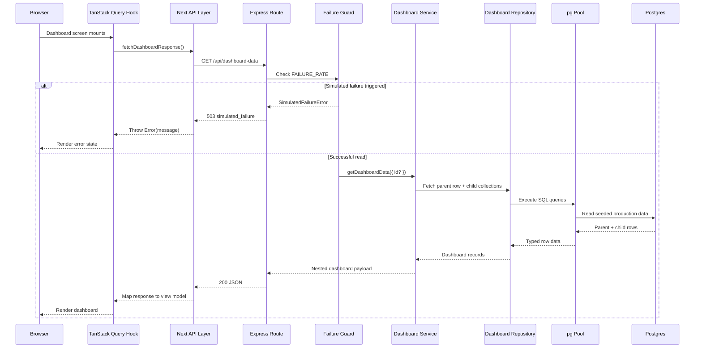

# Dashboard API Flow

```mermaid
sequenceDiagram
  participant Browser
  participant Query as TanStack Query Hook
  participant FrontendAPI as Next API Layer
  participant Route as Express Route
  participant Chaos as Failure Guard
  participant Service as Dashboard Service
  participant Repository as Dashboard Repository
  participant PG as pg Pool
  participant Postgres

  Browser->>Query: Dashboard screen mounts
  Query->>FrontendAPI: fetchDashboardResponse()
  FrontendAPI->>Route: GET /api/dashboard-data
  Route->>Chaos: Check FAILURE_RATE

  alt Simulated failure triggered
    Chaos-->>Route: SimulatedFailureError
    Route-->>FrontendAPI: 503 simulated_failure
    FrontendAPI-->>Query: Throw Error(message)
    Query-->>Browser: Render error state
  else Successful read
    Chaos->>Service: getDashboardData({ id? })
    Service->>Repository: Fetch parent row + child collections
    Repository->>PG: Execute SQL queries
    PG->>Postgres: Read seeded production data
    Postgres-->>PG: Parent + child rows
    PG-->>Repository: Typed row data
    Repository-->>Service: Dashboard records
    Service-->>Route: Nested dashboard payload
    Route-->>FrontendAPI: 200 JSON
    FrontendAPI-->>Query: Map response to view model
    Query-->>Browser: Render dashboard
  end
```
